# ZeppOS Nextcloud Tasks - User Guide

## Table of Contents
1. [Overview](#overview)
2. [Initial Setup](#initial-setup)
3. [Using the Watch App](#using-the-watch-app)
4. [Settings](#settings)
5. [Managing Tasks](#managing-tasks)
6. [Editing Tasks](#editing-tasks)
7. [Subtasks & Calendar Integration](#subtasks--calendar-integration)
8. [Reminders & Alarms](#reminders--alarms)
9. [Native Keyboard](#native-keyboard-api-42)
10. [Local Lists (Offline Mode)](#local-lists-offline-mode)
11. [Tips & Tricks](#tips--tricks)

---

## Overview

ZeppOS Nextcloud Tasks is a comprehensive task management application with full Nextcloud/CalDAV synchronization. Manage tasks, create subtasks, set priorities and categories, configure reminders - all synced with your Nextcloud server or stored locally on your device.

**Key Features:**
- Full Nextcloud/CalDAV sync with proxy architecture
- Offline local lists stored on watch
- App-based persistent reminders (no phone needed)
- Native voice dictation for quick task entry
- Priorities, categories, subtasks, due dates
- Compatible with Tasks.org and standard CalDAV clients

---

## Initial Setup

<p align="center">
  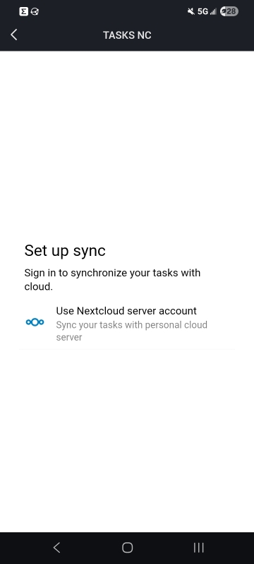
</p>

When you first install the app, you'll need to configure Nextcloud synchronization through the Zepp phone app.

### Connecting to Nextcloud:

1. Open **Zepp app** on your phone
2. Go to **App Settings** → **Tasks NC**
3. You'll see the **"Set up sync"** screen
4. Tap **"Use Nextcloud server account"**
5. Enter your connection details (see next section)

**Note:** This step is done in the Zepp phone app, not on the watch. The watch will sync automatically after configuration.

---

### Nextcloud Configuration

<p align="center">
  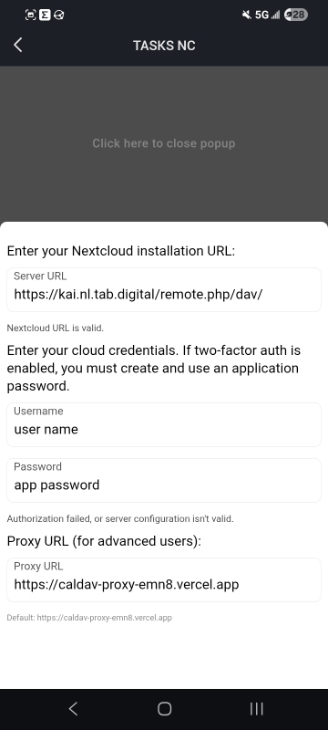
</p>

After tapping "Use Nextcloud server account", you'll need to enter your connection details:

#### Server URL
Enter your Nextcloud CalDAV URL:
```
https://your-nextcloud-server.com/remote.php/dav/
```

**Important:** 
- Must be the full CalDAV path ending in `/dav/`
- Example: `https://kai.nl.tab.digital/remote.php/dav/`

The app will validate the URL and show "Nextcloud URL is valid" if correct.

#### Username
Your Nextcloud username (not email address).

#### Password
Your Nextcloud password **OR** app password.

**If you have two-factor authentication (2FA) enabled:**
- You MUST create an app password in Nextcloud
- Go to Nextcloud Settings → Security → Devices & sessions
- Create a new app password
- Use that password here instead of your main password

#### Proxy URL (Advanced Users)
**Default:** `https://caldav-proxy-emn8.vercel.app`

**Most users:** Leave this as the default - it works for everyone.

**Advanced users:** You can self-host your own proxy instance if desired. Instructions available in the [README](https://github.com/ether-strannik/zeppos-tasks-nc-api4#nextcloud-setup) and [CalDAV Proxy Repository](https://github.com/ether-strannik/caldav-proxy).

**Why a proxy?** ZeppOS only supports GET/POST methods, but CalDAV needs PROPFIND/REPORT/PUT/DELETE. The proxy translates these for compatibility.

---

### Login Success

<p align="center">
  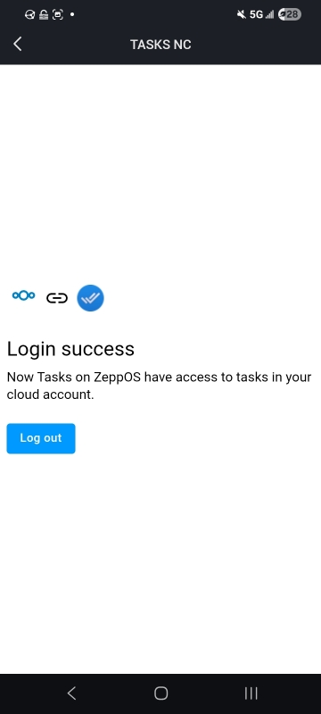
</p>

After entering your credentials correctly, you'll see the **"Login success"** confirmation screen.

**What this means:**
- Your credentials have been validated
- The app can now access your Nextcloud tasks
- Your watch will automatically sync with your Nextcloud server

**Next steps:**
- The configuration is saved in the Zepp app
- Open the Tasks NC app on your watch
- Pull down to sync and download your tasks

**To disconnect:** Tap **"Log out"** if you need to change servers or credentials.

---

## Using the Watch App

### Task Lists Screen

<p align="center">
  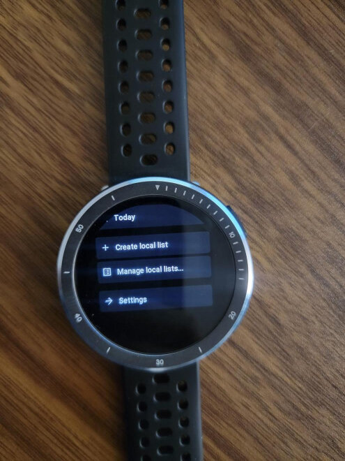
</p>

After setup, open the Tasks NC app on your watch. You'll see the **Task Lists** screen where you can navigate between your task lists.

**What you'll see:**

#### CalDAV Lists (Synced from Nextcloud)
- Lists synced from your Nextcloud server appear at the top
- Example: **"Today"** - your default Nextcloud task list
- Tap any list to view its tasks
- Pull down to refresh and sync with server

#### Local Lists (Offline)
- **+ Create local list** - Create a new offline task list stored on your watch
- **📋 Manage local lists...** - View, edit, or delete existing local lists
- Local lists work completely offline without internet

#### Settings
- **⚙️ Settings** - Configure app preferences (sorting, display options, etc.)

**Tip:** You can use both CalDAV and local lists simultaneously. For example, sync work tasks from Nextcloud while keeping personal tasks in a local list.

---

## Settings

<p align="center">
  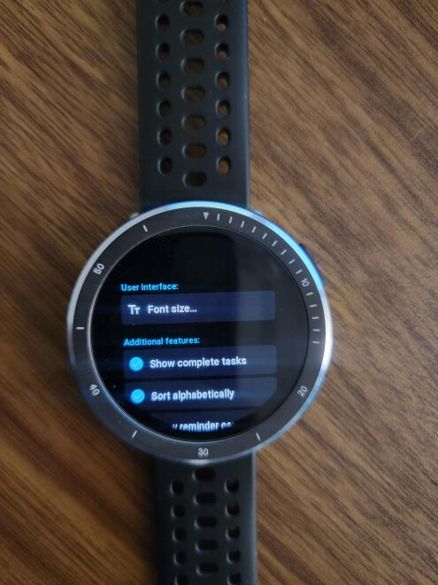
</p>

<p align="center">
  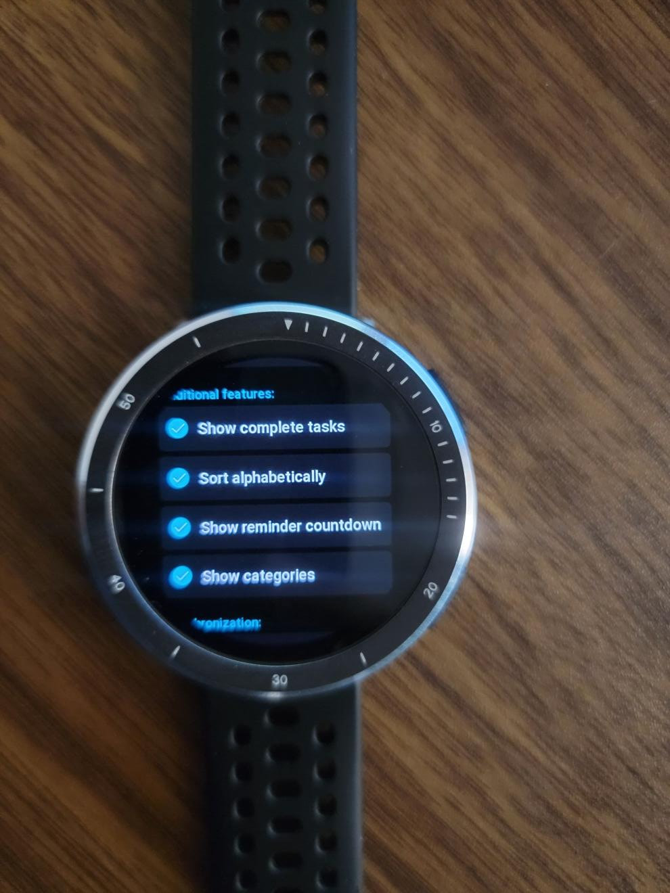
</p>

<p align="center">
  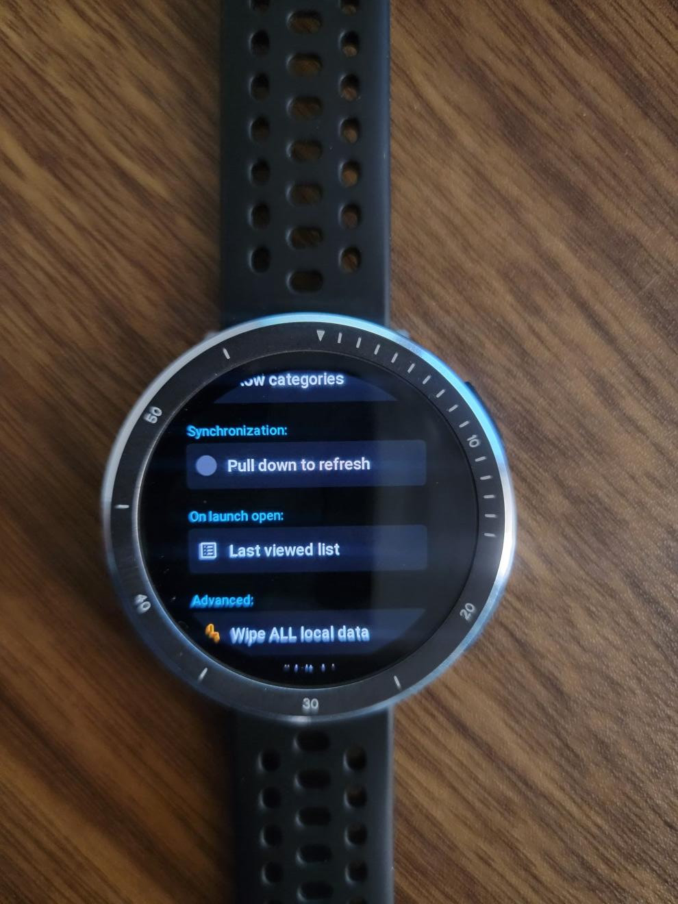
</p>

Access the Settings screen by tapping **⚙️ Settings** from the Task Lists screen.

### User Interface

**Tt Font size...**
- Adjust text size for better readability
- Tap to cycle through available sizes
- Affects task titles and descriptions

### Additional Features

**✓ Show complete tasks**
- Toggle ON: Completed tasks remain visible in your list (shown with checkmark)
- Toggle OFF: Completed tasks are hidden from view
- Helps keep your list focused on active tasks

**✓ Sort alphabetically**
- Toggle ON: Tasks are sorted A-Z by title
- Toggle OFF: Tasks appear in the order they were created
- Applies within each task list

**✓ Show reminder countdown**
- Toggle ON: Display time until due date (e.g., "8.5h", "2d")
- Toggle OFF: Hide countdown badges
- Helpful for seeing how much time is left at a glance

**✓ Show categories**
- Toggle ON: Display category tags on tasks (e.g., [#Work], [#Personal])
- Toggle OFF: Hide category badges
- Useful if you use categories to organize tasks

### Synchronization

**○ Pull down to refresh**
- Toggle ON: Enable pull-down gesture to sync with Nextcloud
- Toggle OFF: Manual sync only (prevents accidental syncs)
- When enabled, swipe down from the top of a task list to sync
- Works like smartphone apps for quick updates

### On Launch Open

**📋 Last viewed list**
- App opens to the last list you were viewing
- Alternative: Tap to select a specific list to always open
- Useful if you primarily use one task list

### Advanced

**⚡ Wipe ALL local data**
- Deletes all cached data and local lists from your watch
- **Your Nextcloud server data is NOT affected** - server tasks remain safe
- Use when:
  - Sync is broken or showing stale/duplicate data
  - You need a clean start with fresh sync
  - Troubleshooting connection issues
- After wiping, pull down to re-sync from Nextcloud
- Cannot be undone!

**Tip:** All settings apply to both CalDAV and local lists.

---

## Managing Tasks

### Task List View

<p align="center">
  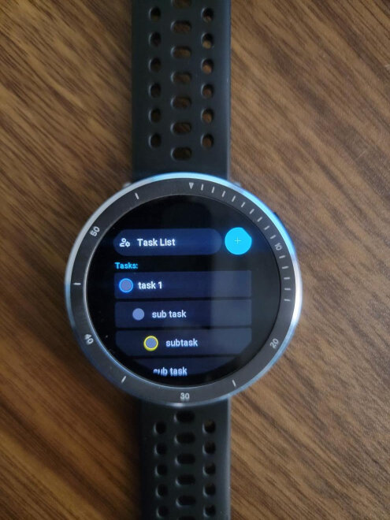
</p>

<p align="center">
  
</p>

When you open a task list, you'll see all your tasks with visual indicators for priorities, subtasks, categories, and due dates.

### Understanding the Task Display

#### Priority Colors (Colored Rings)
- **Red ring** - High priority (1-4)
- **Yellow ring** - Medium priority (5)
- **Blue ring** - Low priority (6-9)
- **Gray/White ring** - No priority (0)

#### Subtasks (Indented)
- Subtasks appear indented under their parent task
- Support unlimited nesting depth
- Can have their own priorities and categories
- Example: "task 1" → "sub task" → "subtask"

#### Category Tags
- Displayed as colored badges next to task name
- Example: **#tag** shown on "task 2"
- Multiple categories can be assigned per task

#### Due Date Countdown
- Shows time remaining until due date
- Example: **(1d)** means 1 day remaining
- Also shows hours: **(8.5h)** for same-day tasks
- Only visible when "Show reminder countdown" is enabled

### Creating New Tasks

**+ Button** (top right)
- Tap the **+** button to create a new task
- Opens the task creation screen with keyboard

---

### Task Interactions

<p align="center">
  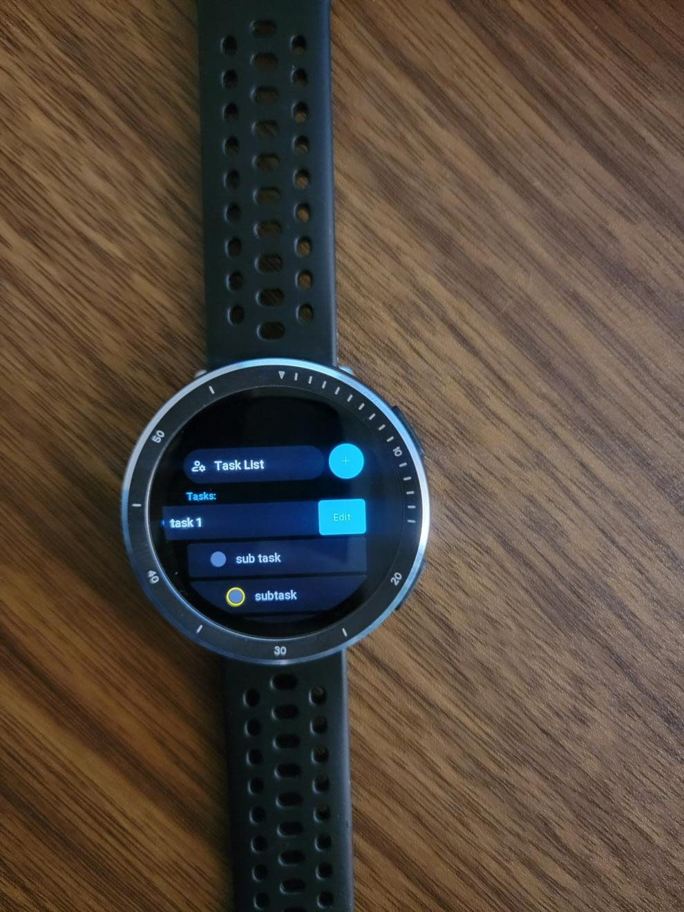
</p>

#### Creating a New Task
**+ Button** (top right)
- Tap the **+** button to create a new task
- Native keyboard will appear for entering task title
- Task is created immediately after typing

#### Navigating Back
**Task List Name** (top left)
- Tap "Task List" header to return to the Task Lists screen
- Your changes are saved automatically

#### Editing a Task
**Swipe to Reveal Edit Button**
- Swipe left on any task to reveal the **Edit** button
- Tap **Edit** to open the full task editor
- Edit title, description, priority, categories, due date, and more

#### Completing Tasks
**Tap the Checkbox**
- Tap the colored ring (checkbox) to mark task complete
- Completed tasks show a checkmark ✓
- If "Show complete tasks" is disabled, completed tasks hide automatically

---

## Editing Tasks

### Task Edit Screen

<p align="center">
  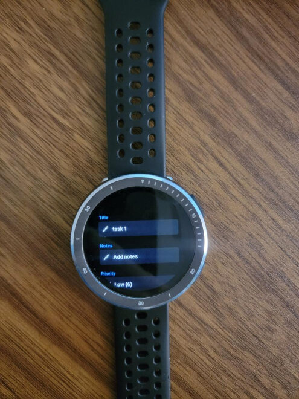
</p>

<p align="center">
  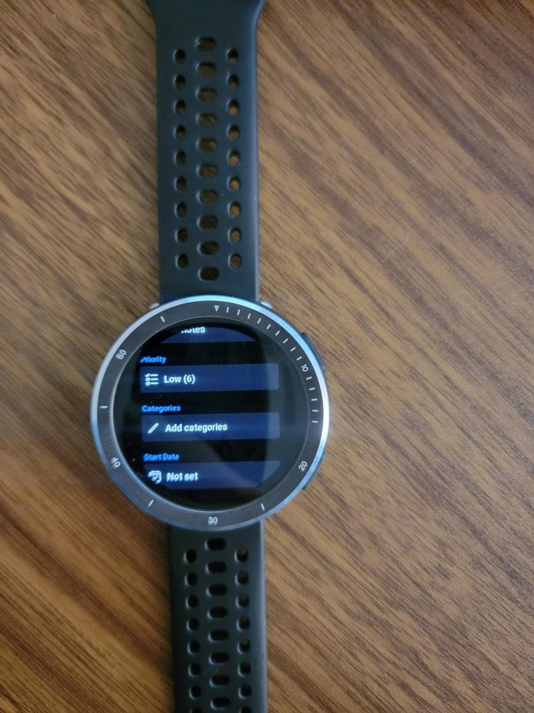
</p>

<p align="center">
  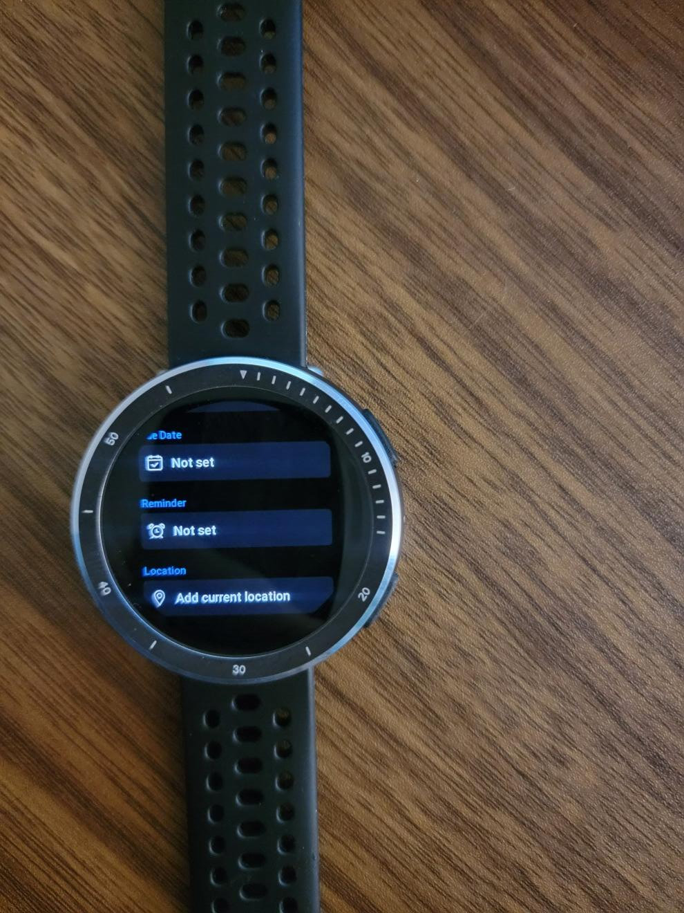
</p>

After tapping **Edit** on a task, you can modify all task properties supported by Nextcloud CalDAV (VTODO format).

### Available Fields

#### Title
- ✏️ **task 1** - Tap to edit task title
- Native keyboard appears for editing
- Required field

#### Notes
- ✏️ **Add notes** - Add detailed description/notes for the task
- Supports multi-line text
- Optional field

#### Priority
- **Low (6)** - Tap to change priority level
- Opens priority picker with grid (0-9)
- Priority colors:
  - 1-4: High (red ring)
  - 5: Medium (yellow ring)
  - 6-9: Low (blue ring)
  - 0: None (default)

#### Categories
- ✏️ **Add categories** - Tag tasks with categories
- Multi-select picker (Work, Personal, Urgent, etc.)
- Create new categories or select existing ones
- Displayed as badges on task list

#### Start Date
- 📅 **Not set** - Set when task should start
- Opens visual calendar picker
- Optional field
- Date validation prevents start date after due date

#### Due Date
- 📅 **Not set** - Set task deadline
- Opens visual calendar picker
- Displays countdown in task list when set
- Optional field

#### Reminder
- ⏰ **Not set** - Configure VALARM reminder
- App-based reminders using ZeppOS Alarm API
- Fires even when app is closed
- Presets: 5min, 10min, 15min, 30min, 1h, 2h, 1d before due
- Compatible with Tasks.org on Android

#### Location
- 📍 **Add current location** - Capture GPS coordinates
- Automatically captures your current position
- Stores both GEO (coordinates) and LOCATION (address) properties
- Optional field

### Saving Changes

- Changes are saved automatically when you navigate back
- The task syncs to Nextcloud immediately (if CalDAV list)
- Local lists save changes to device storage

**Note:** RRULE (recurring tasks) is currently in development and not yet available.

---

## Subtasks & Calendar Integration

### Additional Task Actions

<p align="center">
  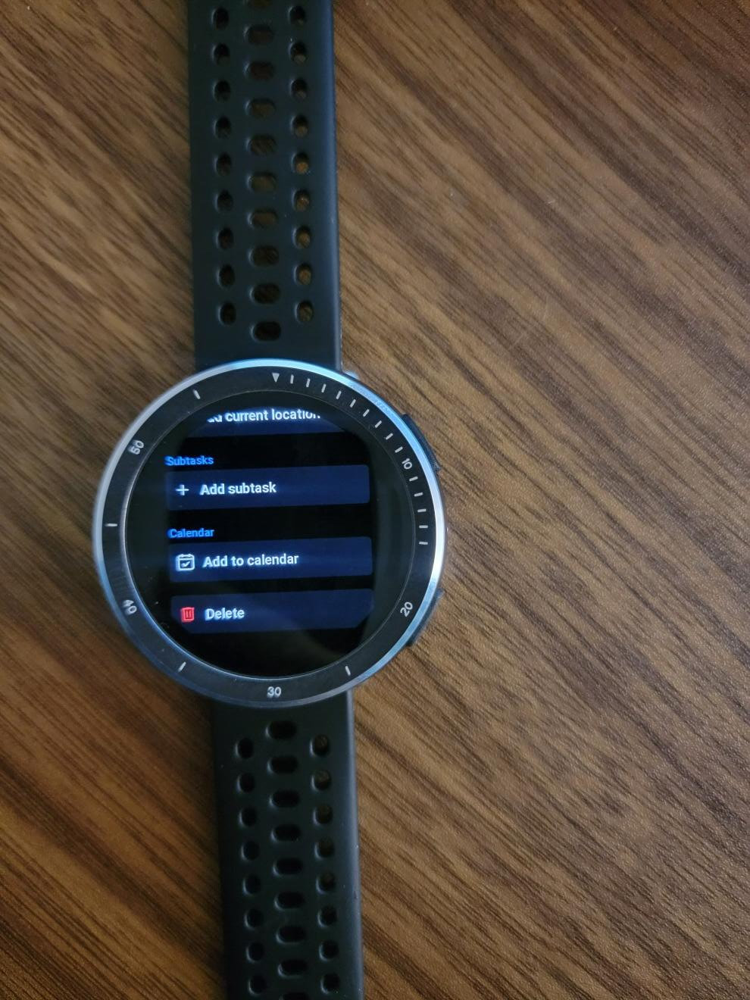
</p>

Scroll down in the task edit screen to access additional features:

#### Subtasks
**+ Add subtask**
- Create a subtask linked to this task
- Uses RELATED-TO property for CalDAV sync
- Subtasks support unlimited nesting depth
- Each subtask can have its own properties (priority, categories, due date)
- Displayed indented in the task list

#### Calendar
**📅 Add to calendar**
- Convert task into a calendar event (VEVENT)
- Syncs to your Nextcloud calendar
- Pre-fills event with task data
- Useful for time-blocking tasks

#### Delete
**🗑️ Delete**
- Permanently delete the task
- Confirmation required (double-tap)
- Syncs deletion to Nextcloud (for CalDAV lists)

---

### Add to Calendar Feature

<p align="center">
  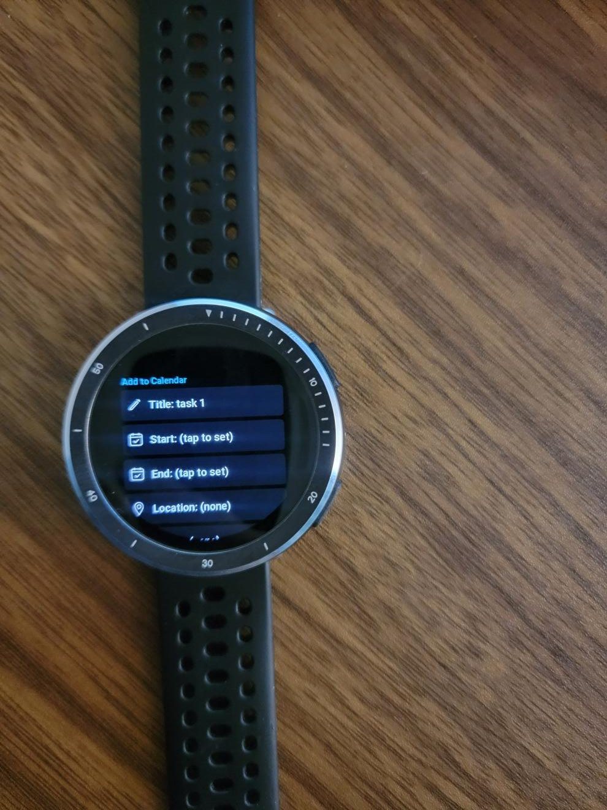
</p>

When you tap **Add to calendar**, you can create a calendar event (VEVENT) from your task:

**Pre-filled Fields:**
- ✏️ **Title: task 1** - Inherited from task title (editable)
- 📅 **Start: (tap to set)** - Set event start time
- 📅 **End: (tap to set)** - Set event end time  
- 📍 **Location: (none)** - Inherited from task location (if set)

**Additional properties synced:**
- Task description → Event description
- Task due date → Suggested event time
- Task location → Event location

**Use cases:**
- Time-block your tasks on calendar
- Create meetings from task items
- Convert reminders to scheduled events
- Sync task deadlines to calendar

After creating the event, it appears in your Nextcloud calendar and syncs to all connected devices.

---

## Reminders & Alarms

### CalDAV Reminders (Standard)

<p align="center">
  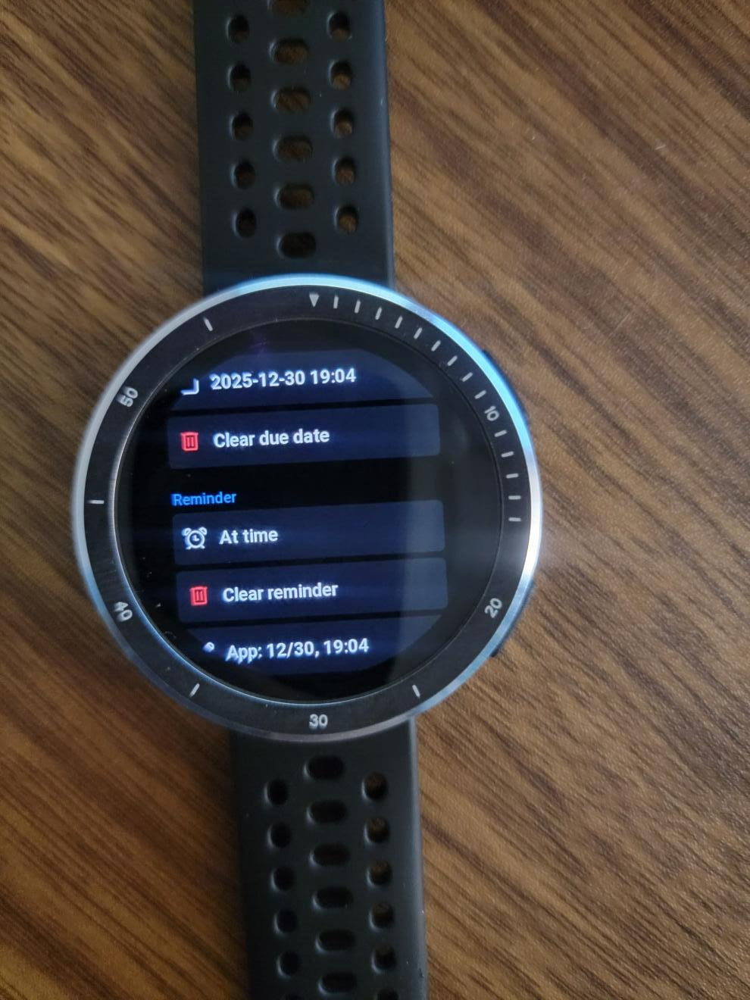
</p>

<p align="center">
  
</p>

#### Setting Standard Reminders

When you set a **Due Date** and **Reminder** on a task, it creates a standard CalDAV VALARM:

**Due Date:** 2025-12-30 19:04
- Tap to set when the task is due
- Opens calendar and time picker

**Reminder Options:**

**Remind me in...**
- **+ Pick duration** - Set custom time from now to remind you

**Before due:**
- **When due** - Reminder at exact due date/time
- **5 min before** - Reminder 5 minutes before due
- **10 min before, 15 min before, 30 min before** (scrollable)
- **1h before, 2h before, 1d before** (more options)

**🗑️ Clear reminder** - Remove the reminder

**How it works:**
- Uses standard VALARM property (Tasks.org compatible)
- Phone app (like Tasks.org) sends notification to Zepp app
- Zepp app displays notification on watch
- **Limitation:** Notification appears once, then disappears
- **Requires:** Phone nearby with Nextcloud sync app running

**App reminder:** 12/30, 19:04
- Shows when the next app-based reminder is scheduled (see below)

---

### App-Based Reminders (Persistent)

**For persistent, watch-native reminders that don't rely on phone notifications:**

The app includes **App-Based Reminders** using ZeppOS Alarm API:

**Key Differences:**
- ✅ **Persistent** - Continuous vibration and sound until dismissed
- ✅ **Works offline** - No phone or internet needed
- ✅ **Alarm-style** - Like a real alarm, not just a notification
- ✅ **Locally saved** - Stored on watch, not CalDAV server
- ✅ **Full control** - Snooze, complete task, or dismiss

**How to enable:**
1. Edit task and set reminder
2. Task edit screen shows **"App: 12/30, 19:04"** - next scheduled alarm
3. When alarm fires, you get full-screen popup with options

**When alarm fires:**
- Full-screen alert popup appears
- Continuous vibration (customizable pattern)
- Sound alerts (optional)
- Options: Complete Task, Snooze, or Dismiss

**Use cases:**
- Important deadlines that can't be missed
- When phone isn't nearby
- Tasks requiring persistent reminders
- Privacy (no phone sync needed)

**Note:** App-based reminders are independent from CalDAV VALARM. You can use both simultaneously for maximum reliability!

---

### Configuring App-Based Reminders

<p align="center">
  
</p>

Before the alarm fires, you can configure default behavior in the task edit screen:

**Sound and vibration:**
- **○ OFF** - Toggle to enable/disable sound and vibration for this task
- Customizable per task

**Snooze:**
- **⏰ 5 min** - Default snooze duration
- Tap to change (1min, 5min, 10min, 15min, 30min, 1h options)
- This is the initial snooze time when alarm fires

**📅 Schedule reminder:**
- Configure when the app-based reminder should fire
- Independent of CalDAV VALARM

---

### When the Reminder Fires

<p align="center">
  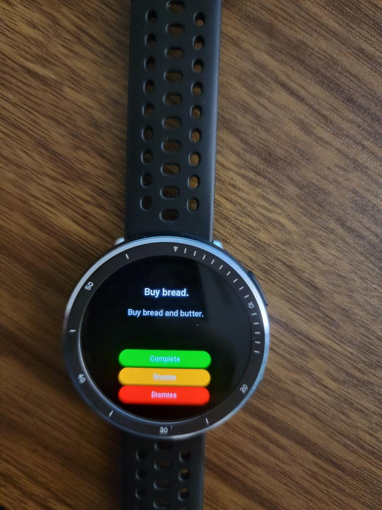
</p>

When your app-based reminder triggers, a full-screen alarm popup appears:

**Task Information:**
- **Title:** "Buy bread."
- **Description:** "Buy bread and butter." (if notes were added)
- Both displayed clearly at the top

**Alert Behavior:**
- Continuous vibration (until dismissed)
- Sound alerts (if enabled)
- Screen stays on for 10 minutes
- Works even when app is closed

**Three Action Buttons:**

**✅ Complete** (Green)
- Marks task as complete
- Cancels all future alarms for this task
- Syncs completion to Nextcloud (if CalDAV list)
- Closes app

**💤 Snooze** (Yellow/Orange)
- Opens time picker to set snooze duration
- Creates new alarm for specified time
- Task remains incomplete
- Closes app

**🔴 Dismiss** (Red)
- Stops vibration and sound immediately
- Task remains incomplete
- No new alarm created
- Closes app

---

### Custom Snooze Duration

<p align="center">
  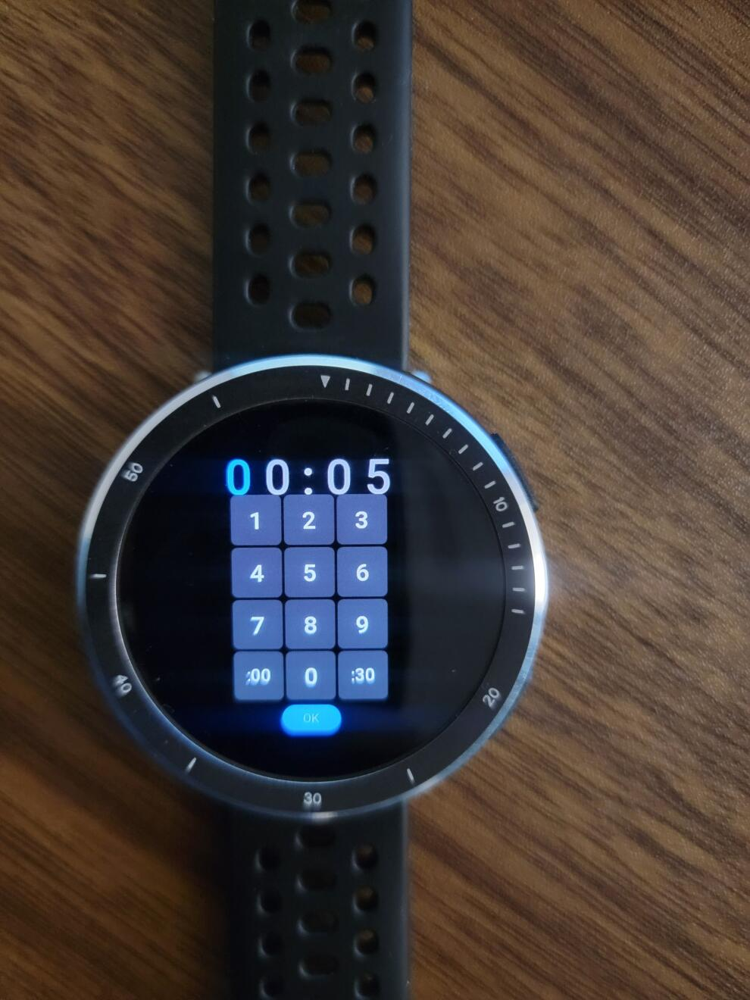
</p>

When you tap **Snooze**, a time picker appears:

**Time Format:** HH:MM
- Default shows your configured snooze time (00:05 = 5 minutes)
- Tap number keys to set custom duration
- Example: "00:30" = 30 minutes, "01:00" = 1 hour

**Quick Entry:**
- **:00** button - Add 00 to hours
- **:30** button - Add 30 to minutes
- Number keys - Enter specific time

**Tap OK** to set the snooze and create new alarm

**Example workflow:**
1. Reminder fires at 2:00 PM
2. Tap **Snooze**
3. Enter "00:15" (15 minutes)
4. New alarm set for 2:15 PM

This flexible snooze system ensures you never miss important tasks, even without your phone nearby!

---

## Native Keyboard (API 4.2)

<p align="center">
  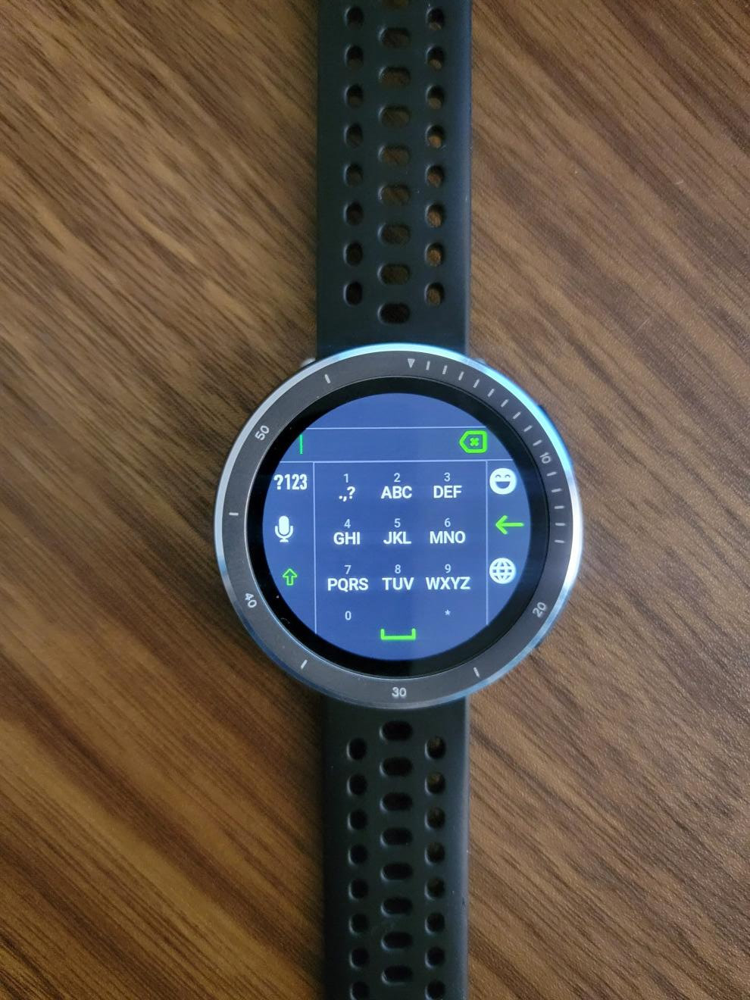
</p>

<p align="center">
  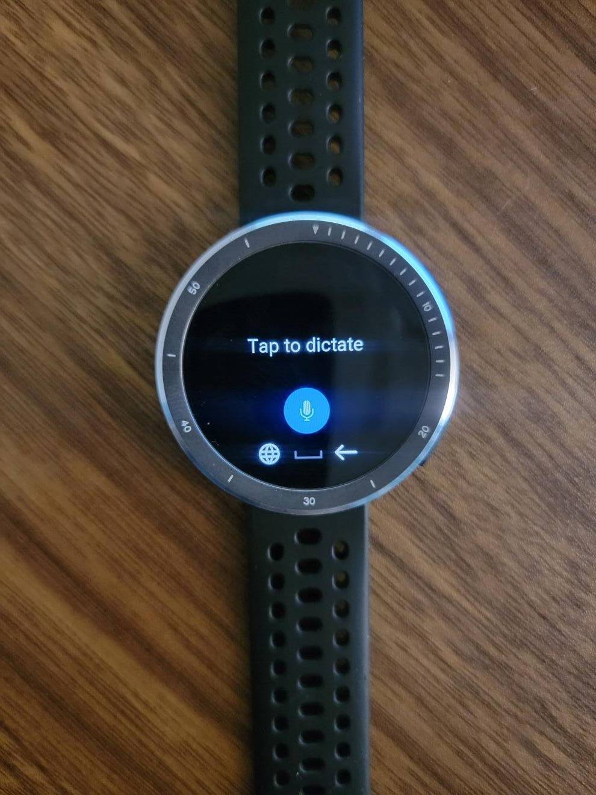
</p>

### SYSTEM_KEYBOARD Integration

Starting with ZeppOS API 4.2, Tasks NC uses the native **SYSTEM_KEYBOARD** for all text input. This provides a much better user experience compared to custom keyboards.

#### T9 Keyboard Layout

The keyboard appears whenever you need to enter text (task titles, notes, categories, list names):

**Layout:**
- **Numeric keypad** - Classic T9 style (like old phones)
- Press number keys multiple times to cycle through letters
- Example: "2" → A → B → C, "5" → J → K → L

**Special Keys:**
- **?123** - Switch to numbers/symbols
- **Microphone 🎤** - Voice dictation (see below)
- **Backspace ←** - Delete characters
- **Emoji 😊** - Insert emojis
- **Globe 🌐** - Switch keyboard language
- **Spacebar** - Add space
- **Up arrow ⬆** - Submit/confirm input

#### Voice Dictation

**The game-changer for task management on your watch:**

Tap the **🎤 microphone icon** to activate voice input:

**"Tap to dictate"**
- Speak naturally into your watch
- Extremely accurate transcription
- Supports full sentences and punctuation
- Works for all text fields

**Perfect for:**
- Creating tasks quickly: "Buy groceries for dinner"
- Adding detailed notes: "Remember to pick up milk, eggs, and bread from the store on Main Street"
- Setting task descriptions without typing
- Creating multiple tasks rapidly
- Adding categories or locations

**Why voice input is essential:**
- **Speed** - Much faster than T9 typing on a watch
- **Accuracy** - Transcription quality is excellent
- **Natural** - Just speak what you need to remember
- **Hands-free** - Great when you're busy or on the go

**Example workflow:**
1. Tap **+** to create task
2. Tap **🎤** microphone
3. Say: "Call dentist to reschedule appointment"
4. Text appears instantly
5. Tap **⬆** to save

This makes Tasks NC truly practical for quick task capture - as fast as pulling out your phone!

---

## Local Lists (Offline Mode)

<p align="center">
  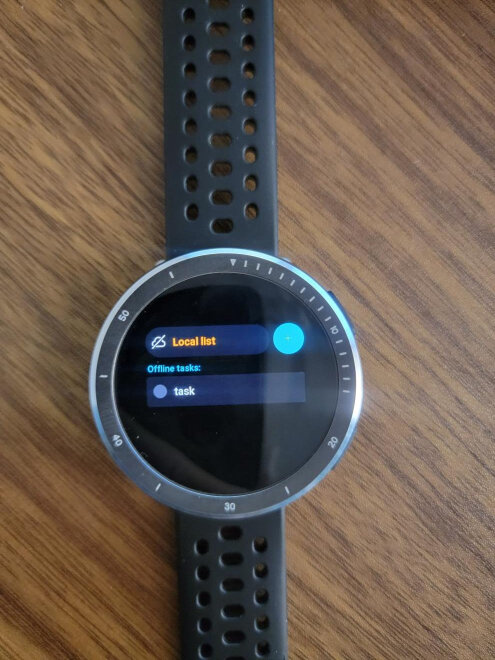
</p>

### Creating and Using Local Lists

Local lists are task lists stored entirely on your watch, independent of any Nextcloud server or internet connection.

**Creating a Local List:**
1. From Task Lists screen, tap **+ Create local list**
2. Enter a name using the native keyboard
3. The list is created and saved locally

**Local List Features:**

Local lists support **all the same features** as CalDAV lists:
- ✅ Task titles and descriptions
- ✅ Priority levels (0-9) with colored rings
- ✅ Categories/tags
- ✅ Subtasks with unlimited nesting
- ✅ Due dates with countdown
- ✅ Start dates
- ✅ GPS location
- ✅ Task completion status
- ✅ Alphabetical sorting
- ⚠️ **Reminders** - Currently in development

**Key Differences from CalDAV Lists:**
- **No sync** - Data stays on your watch only
- **No internet needed** - Works completely offline
- **Privacy** - Tasks never leave your device
- **Fast** - No network delays
- **Independent** - Not tied to any server

**Use Cases:**
- Personal tasks you don't want synced
- Privacy-sensitive information
- Quick temporary task lists
- When you don't have a Nextcloud server
- Offline-only workflows

**Managing Local Lists:**
- Tap **📋 Manage local lists...** from Task Lists screen
- Select lists to delete (multi-select)
- Local lists persist across app restarts

**Combined Workflow:**
You can use local lists and CalDAV lists simultaneously. For example:
- Work tasks → CalDAV list (synced with team)
- Personal tasks → Local list (private, offline)

---

### Managing Local Lists

<p align="center">
  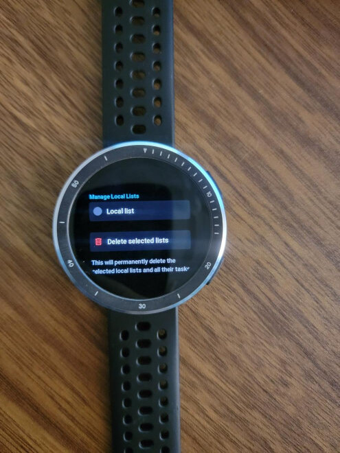
</p>

<p align="center">
  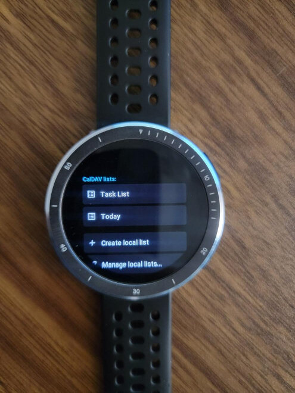
</p>

#### Deleting Local Lists

From the Task Lists screen, tap **📋 Manage local lists...** to manage your offline lists.

**Manage Local Lists Screen:**
- Lists all local lists stored on your watch
- Tap a list name to select it (checkbox appears)
- Select multiple lists if needed

**🗑️ Delete selected lists**
- Tap to delete all selected lists
- **Warning:** "This will permanently delete the selected local lists and all their tasks"
- Cannot be undone - tasks are permanently removed from your watch
- CalDAV lists are unaffected

#### Task Lists Overview

The main **Task Lists** screen shows all your lists organized by type:

**CalDAV Lists:**
- Synced from your Nextcloud server
- Examples: "Task List", "Today"
- Pull down to refresh and sync
- Require internet connection

**Local Lists:**
- **+ Create local list** - Create new offline list
- **📋 Manage local lists...** - Delete existing local lists

**Combined View:**
- Both CalDAV and local lists accessible from same screen
- Switch between them seamlessly
- Use both simultaneously for different purposes

---

## Tips & Tricks

### Quick Task Capture
- Use **voice dictation** (🎤) for fastest task creation
- Speak naturally: "Buy groceries tonight at 6pm"
- Add details immediately while you remember them

### Sync Best Practices
- **Pull down to refresh** when you need latest tasks from Nextcloud
- Enable "Pull down to refresh" in Settings for quick sync gesture
- If sync fails, try **Wipe ALL local data** in Settings (server data is safe)

### Reminder Strategy
**For maximum reliability, use both:**
- **CalDAV VALARM** - Phone notifications (requires phone nearby)
- **App-based reminders** - Watch alarms (works offline, persistent)

**When to use each:**
- CalDAV: Routine tasks, when phone is always nearby
- App-based: Critical deadlines, when phone might not be available

### Organization Tips
- Use **priorities** (1-9) to color-code importance at a glance
- Use **categories** to group related tasks (#Work, #Personal, #Urgent)
- Create **subtasks** for multi-step projects
- Use **local lists** for private tasks that shouldn't sync

### Battery Optimization
- Disable "Show reminder countdown" if you don't need it
- Turn off app-based reminders for non-critical tasks
- Use local lists to avoid constant sync overhead

### Keyboard Shortcuts
- **Swipe left** on task → reveals Edit button (faster than opening)
- **Double-tap** to delete tasks (prevents accidents)
- **Tap list name** at top to go back (don't hunt for back button)

### Troubleshooting
**Sync not working?**
1. Check credentials in Zepp app settings
2. Verify server URL ends with `/dav/`
3. Use app password if you have 2FA enabled
4. Try "Wipe ALL local data" for fresh start

**App-based reminders not firing?**
1. Check that alarm is set ("App: date/time" shown in edit screen)
2. Verify sound/vibration enabled in task settings
3. Ensure watch has sufficient battery

**Tasks not showing?**
1. Pull down to refresh
2. Check "Show complete tasks" setting
3. Verify you're in correct list

---

## Support

For issues, feature requests, or questions:
- **GitHub Issues:** [https://github.com/ether-strannik/zeppos-tasks-nc-api4/issues](https://github.com/ether-strannik/zeppos-tasks-nc-api4/issues)
- **README:** [https://github.com/ether-strannik/zeppos-tasks-nc-api4](https://github.com/ether-strannik/zeppos-tasks-nc-api4)

---

**Original project:** [melianmiko/ZeppOS-Tasks](https://github.com/melianmiko/ZeppOS-Tasks)
